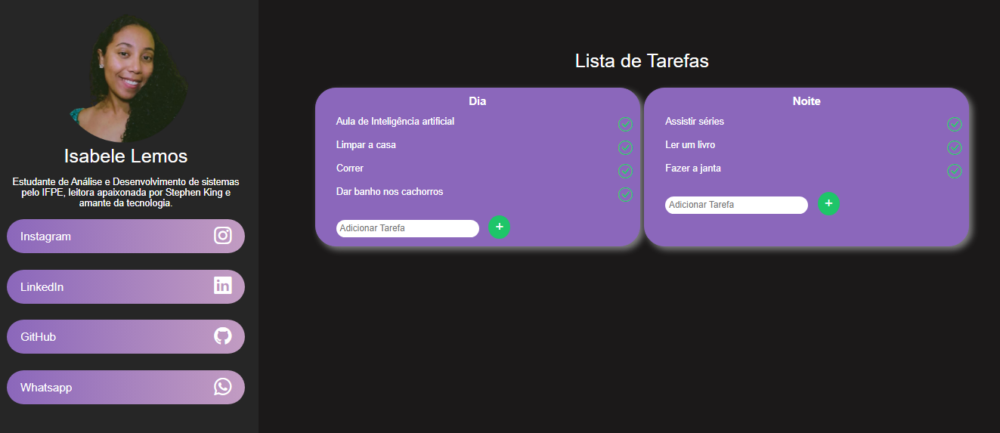

# Desafio de Criação de Layout

Desafio criado para a 2° fase do processo seletivo do Programa Aceleradora Ágil.




## Descrição do Desafio
1. Crie um layout de largura e altura variável de acordo com o conteúdo da página, dividido em duas
regiões distintas (menu esquerdo e conteúdo principal), siga as instruções abaixo:

   
3. No menu esquerdo, 
coloque uma imagem de um ícone padrão, um Nome genérico abaixo da imagem e
um texto.
4. Para criar uma formatação para o menu esquerdo com os 4 links, utilize a estrutura abaixo:

 ``` 
 <ul>
   <li><a href=”#”>Link1</a></li>
   <li><a href=”#”>Link2</a></li>
   <li><a href=”#”>Link3</a></li>
   <li><a href=”#”>Link4</a></li>
 </ul>
```

   Crie uma formatação para esse menu.

6. Na área principal, crie um título chamado "Lista de tarefas" e adicione uma tabela Dia e Noite
lado a lado. Em cada tabela, crie uma lista ordenada com tarefas genéricas a serem feitas
durante uma rotina.

### *Desafio*
● Para aprimorar a experiência do usuário, aplique um estilo personalizado ao layout,
tornando-o mais agradável e intuitivo.
● Deixe a lista de tarefas dinâmica com as funcionalidades de adição e remoção de tarefas.

### *Funcionalidades do Projeto*
- `Funcionalidade 1`: Remover tarefas.
- `Funcionalidade 2`: Adicionar tarefas.


## Tecnologias Utilizadas

* **HTML5**: usado para estruturar a página da web.

* **CSS3**: Usado para estilizá-la.

* **JavaScript**: Usado para adicionar interatividade.
  
* **Biblioteca Bootstrap Icon**: Usado para fornecer ícones estilizados.


## ✒️ Autora

* **Isabele Lemos** - [LinkedIn](https://www.linkedin.com/in/isabele-lemos-5568b5215/)
Acesse e navegue pelo site através do link: http://layoutagil.io/


